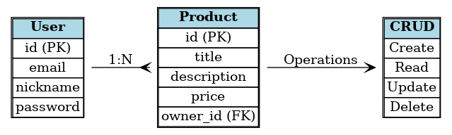
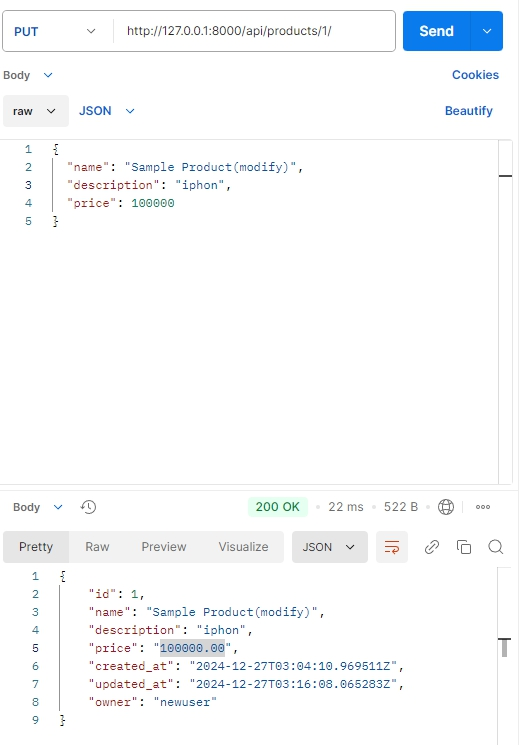

# 스파르타 마켓 프로젝트

## 프로젝트 개요
스파르타 마켓은 사용자가 상품을 게시하고, 다른 사용자와 소통할 수 있는 간단한 마켓플레이스 웹 애플리케이션입니다. Django를 기반으로 구현되었으며, 회원 기능, 유저 기능, 게시 기능을 포함하고 있습니다.

---

## 주요 기능

### 1. 회원 기능
- 회원가입: 이메일, 비밀번호, 닉네임을 입력하여 가입.
- 로그인: 이메일과 비밀번호를 통해 인증.

### 2. 유저 기능
- **프로필 페이지**: 사용자 정보 확인 및 업데이트.


### 3. 게시 기능
- **물건 CRUD**:
  - **등록**: 새로운 상품을 등록.
  - **조회**: 전체 상품 목록 및 상세 정보 확인.
  - **수정**: 등록된 상품 정보 수정.
  - **삭제**: 상품 삭제.


---

## ERD 설계



### 주요 테이블

#### 1. User
- **id**: 사용자 고유 ID
- **email**: 사용자 이메일
- **nickname**: 사용자 닉네임
- **password**: 암호화된 비밀번호

#### 2. Product
- **id**: 상품 고유 ID
- **title**: 상품 제목
- **description**: 상품 설명
- **price**: 상품 가격
- **owner_id**: 상품 등록 사용자 (ForeignKey)


---

## 문제 해결 과정

### 1. 기능 구현 순서
1. 회원 기능부터 구현하여 인증 및 권한 관리를 확립.
2. 유저 기능 구현으로 사용자 간 상호작용 기능 개발.
3. 게시 기능을 통해 프로젝트의 핵심 기능 완성.

### 2. 주요 문제 및 해결 방안
- **회원가입 시 이메일 중복 확인**:
  - `unique=True` 속성을 사용하여 중복 등록 방지.
- **상품 조회 시 성능 문제**:
  - `select_related` 및 `prefetch_related`를 사용하여 DB 쿼리 최적화.
- **찜 기능 중복 방지**:
  - unique constraint를 통해 사용자와 상품의 조합이 중복되지 않도록 설정.

---

## Postman 테스트

### 주요 API 테스트 캡처
Postman을 통해 주요 API를 테스트한 결과입니다. 자세한 스크린샷은 다음 링크를 참조하세요.

- **상품 정보 수정**: 성공적으로 정보수정 가능 확인.




---

## 사용 기술

- **Backend**: Django, Django REST Framework
- **Database**: SQLite (개발 환경), PostgreSQL (배포 환경 준비 중)
- **Tools**: Postman, Git, VSCode

---

## 설치 및 실행 방법

### 1. 클론 및 설치
```bash
# Repository 클론
git clone https://github.com/username/sparta-market.git

# 프로젝트 디렉토리로 이동
cd sparta-market

# 가상환경 생성 및 활성화
python -m venv venv
source venv/bin/activate  # Windows의 경우: venv\Scripts\activate

# 의존성 설치
pip install -r requirements.txt
```

### 2. 데이터베이스 마이그레이션
```bash
python manage.py makemigrations
python manage.py migrate
```

### 3. 서버 실행
```bash
python manage.py runserver
```

---

## 개발 기간
- 프로젝트 시작일: 2024년 12월 25일
- 프로젝트 마감일: 2024년 12월 27일

---

## 개발자
- **김동찬**: 프로젝트 설계 및 구현 전반

---

